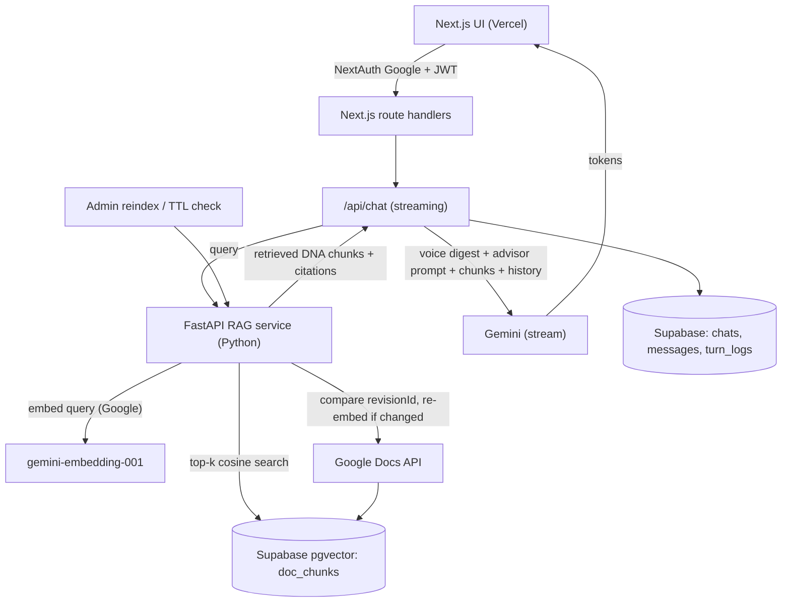

# Eskwelabs AI Advisor - RAG Overhaul (Next.js + FastAPI)

## 1. Problem & Goals

The current app ([routers/chat.py](routers/chat.py), [services/prompt.py](services/prompt.py)) fetches the entire ~30pp DNA doc plus the advisor doc from Google Docs on every turn and stuffs them into Gemini's `system_instruction`. No caching, no retrieval, no streaming, no citations, no token/cost logging, no evals. This is lossy, slow, and costs full-doc tokens every message.

Goal: turn the prompt-stuffing chatbot into a real RAG chatbot - retrieve only the relevant DNA passages per query, ground replies in cited sources, stream responses, and measure quality with evals - while preserving the "edit Google Doc -> live, no redeploy" control plane.

## 2. Requirements (from system-design Lesson 2.3)

- Speed: first token <= ~3s (streaming).
- Cost: per-turn tokens drop sharply (retrieve top-k DNA chunks instead of ~15k-token full doc).
- Accuracy: weighted rubric >= 3.5/5 (PRD section 7).
- Freshness: doc edits live within 5-min TTL via revision-aware re-embed.
- Consistency: low temperature; advisor persona always fully present.
- Privacy: DNA/advisor prompt text never reaches client; only retrieved-chunk citations (section labels) surfaced.

## 3. Target Architecture (Hybrid)

## 4. Components (one line each)

- Next.js app (`/web`): UI (chat, advisor picker, history, streaming render with citations), NextAuth Google login + allow-list check, `/api/chat` streaming orchestrator, chats CRUD via Supabase.
- FastAPI RAG service (`/rag-service`): `/ingest` + `/reindex` (revision-aware chunk + embed + upsert), `/retrieve` (embed query, pgvector top-k, return chunks + section labels), `/voice-digest` (regenerate always-on DNA voice/lexicon digest on change).
- Supabase pgvector: `documents` (doc_id, kind, revision_id, voice_digest, updated_at), `doc_chunks` (id, doc_id, chunk_index, heading, content, embedding vector, revision_id), plus existing `allowed_users`, `chats`, `messages` and a new `turn_logs` (tokens, cost, latency, model, retrieved_chunk_ids, status).
- Eval harness (`/rag-service/evals`): golden Q/A set per advisor + retrieval metrics (hit@k) + LLM-as-judge on PRD rubric.

## 5. Retrieval-time assembly

Final system message = `voice digest` (always-on, small) + `full advisor prompt` (cached, by advisor_id) + `retrieved DNA chunks` (top-k=5, labeled with section headings for citation) + conversation history + user message. Advisor docs are NOT chunked - the full persona is always present. DNA is the only retrieval corpus.

## 6. Ingestion / freshness

Store each doc's Google `revisionId` with its chunks. On a 5-min TTL check, a cheap Docs metadata call compares `revisionId`; if changed -> re-chunk (split DNA by heading into ~300-500 token chunks w/ overlap) -> re-embed -> upsert and delete stale chunks; also regenerate the voice digest. Manual admin `/reindex` endpoint forces it. Advisor prompts cached in-memory with the same TTL/revision check.

## 7. Failure modes & guards (Lesson 2.4)

- Doc fetch fails, no index: serve last-good chunks/digest; if none, user-facing error, no LLM call.
- Retrieval returns nothing relevant: fall back to voice digest + advisor prompt only; flag low-grounding.
- Hallucination: ground in retrieved chunks, show citations, eval set catches regressions.
- Prompt injection: keep retrieved/user content separate from instructions; never echo system prompt/DNA.
- Runaway cost: cap top-k, cap max output tokens, cap history window, persist token/cost per turn.
- Slow tail: stream tokens; timeout + graceful error.
- Drift: pin Gemini + embedding model versions; re-run eval set on changes.

## 8. Cost

Per turn drops from ~15k system tokens to voice digest (~few hundred) + k*chunk (~5 x ~400) + history. Embedding cost paid only on doc change (revision-aware), not per turn. Query embedding is one small call per message.

## 9. Eval plan (product-engineering loop)

- Golden set: 15-30 representative questions per advisor with expected DNA sections + reference answers, stored in repo.
- Retrieval metric: hit@k / recall of expected DNA sections.
- Generation metric: LLM-as-judge scoring the 7 PRD rubric criteria (weighted), pass >= 3.5/5.
- Run as a script (and CI hook); log scores; compare before/after each prompt or model change.

## 10. Rollout

1. Stand up Supabase pgvector schema + migrations. 2. Build FastAPI RAG service (ingest/retrieve/digest) with the existing 4 docs; verify retrieval quality offline with eval set. 3. Scaffold Next.js app, port auth + chats CRUD, wire `/api/chat` streaming to call RAG service + Gemini. 4. Add citations UI + token/cost logging. 5. Run eval harness, tune k/chunking/digest. 6. Deploy: Next.js to Vercel, FastAPI to Vercel Python functions or a separate host (decision at deploy time).

## 11. Open questions / risks

- FastAPI deploy target (Vercel Python serverless vs separate host like Render/Fly) - decide at deploy step.
- Whether advisor docs should also be lightly chunked if they grow large (currently no).
- Citation granularity (section heading vs sentence) - start at section.
- Deferred (not in this overhaul): admin usage dashboard, multi-provider abstraction, persistent rate limiting, RLS hardening.